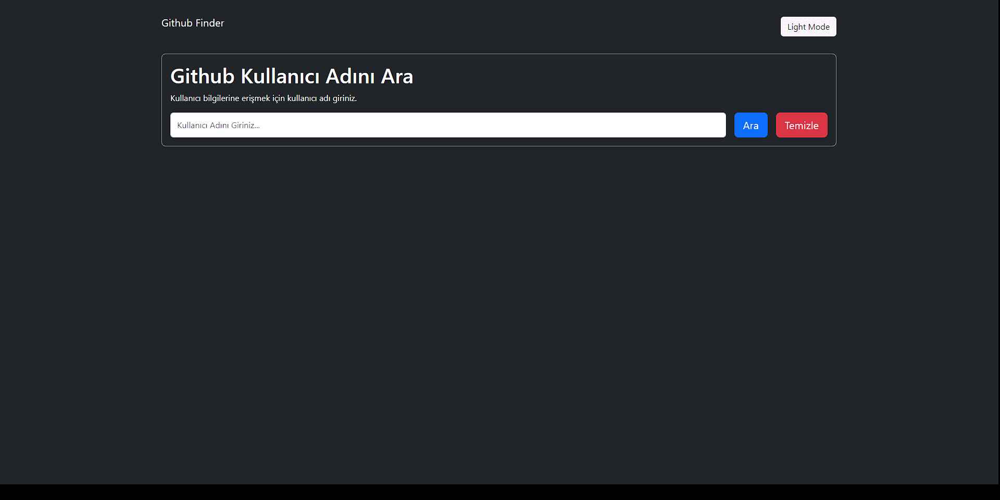

# Github Finder Application

## Description

This is a web application developed using Github OAuth Apps to find Github users.

## Technologies Used

- HTML
- CSS
- JavaScript

## How to Use

1. Clone the repository:
   ```bash
   git clone https://github.com/KamilErdogmus/Github-Finder.git
   ```
2. Open the index.html file in your browser

# GIF



# Link

[Website](https://663bbd014f86f41219c87a55--silly-selkie-610495.netlify.app/)

